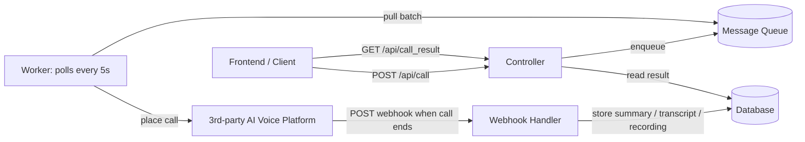

# Pixel Voice Call Service

Pixel Voice Call Service is a B2B AI voice calls platform for our clients. A user requests a call from  
the frontend; we place that call through a third-party AI voice platform; and when the  
call finishes we capture and store an AI-generated **summary**, the full **transcript**,
and the call **recording**. Clients then fetch these results to run their own **analysis**
and **export them to CSV**.

## How it works today




1. **Intake** — The frontend sends a call request to the **Controller** (`POST /api/call`).
2. **Queue** — The Controller writes the request onto a **message queue**.
3. **Dispatch** — A **worker** polls the queue every **5 seconds** and forwards the pulled
  requests to the **third-party AI voice platform**, which places the actual call.
4. **Webhook** — When a call ends, the platform sends a **webhook** back to us.
5. **Persist** — The **webhook handler** stores the AI-generated summary, the transcript,
  and the recording in the **database**.
6. **Retrieve** — The client later reads the result via the Controller (`GET /api/call_result`).

### Retrieving results

Clients place a call with `POST /api/call` and, once the call has finished, fetch the result
with `GET /api/call_result` — the AI **summary**, the full **transcript**, and the **recording**.
Clients use these results for their own **analysis** and to **export them to CSV**.

### Provider constraint: concurrent voice slots

The third-party AI voice platform caps how many calls an account can have **in progress at
the same time**. Each account comes with a fixed number of concurrent **voice slots**
(**100 slots per account**); additional slots can be purchased at **$10 per slot**. Placing a
call occupies one slot for the duration of the call, and the slot is freed when the call ends
(i.e. when the webhook fires). If all slots are in use, the provider will not accept additional
calls until a slot frees up.

The **average call lasts about 1 minute**.

### Do-Not-Call (DNC) list

If the person on the other end explicitly asks not to be called again, the AI **summary**
flags that call as **DNC**. When the webhook handler processes such a result, it adds that
number to a **Do-Not-Call list**. The Call Service must not place calls to numbers on the
DNC list — those requests are skipped at intake. The DNC list is shared backing data that
the Webhook Handler writes and the Call Service reads.

## Running it

The pipeline runs as three independently deployable tiers: the Controller, the Worker,
and the Webhook Handler. The message queue and database are shared backing services the
tiers connect to (via `QUEUE_URL` / `DATABASE_URL`).

### With Docker (recommended)

Requires Docker with Compose v2.

```bash
docker compose up --build
```

This starts one container per tier (Controller on `:8000`, Webhook Handler on `:8001`,
and the Worker in the background). Stop everything with:

```bash
docker compose down
```

### Locally

Requires Python 3.10+. Install dependencies first (`pip install -r requirements.txt`), then
run each tier in its own terminal:

```bash
python -m pixel_call.entrypoint controller
python -m pixel_call.entrypoint worker
python -m pixel_call.entrypoint webhook
```

Configuration is via environment variables:


| Variable                | Used by             | Default     | Meaning                              |
| ----------------------- | ------------------- | ----------- | ------------------------------------ |
| `QUEUE_URL`             | controller, worker  | `memory://` | Message queue connection             |
| `DATABASE_URL`          | controller, webhook | `memory://` | Database connection                  |
| `PORT`                  | controller          | `8000`      | Port the Controller API listens on   |
| `POLL_INTERVAL_SECONDS` | worker              | `5`         | How often the worker polls the queue |


## Goal

Usage is growing fast. Call volume is expected to climb through roughly these stages:


| Stage     | Approx. volume      |
| --------- | ------------------- |
| Today     | ~200 calls/hour     |
| Near term | ~1,000 calls/hour   |
| Mid term  | ~10,000 calls/hour  |
| Target    | ~100,000 calls/hour |


The objective is to keep this pipeline **reliable and responsive** end to end — from request
intake through to stored results — as throughput grows by roughly **500x**.

Note: each account has 100 concurrent voice slots and the average call lasts ~1 minute.